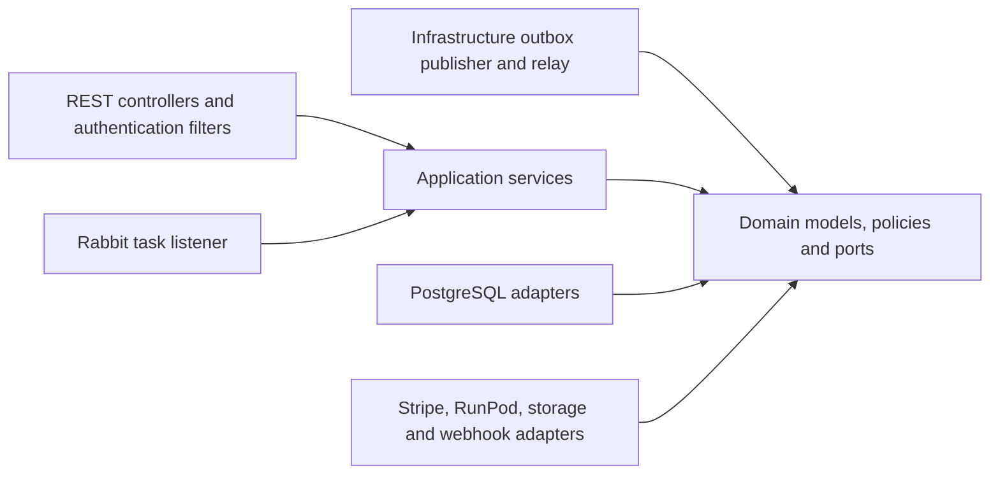

# thridify architecture

The backend uses Domain Service Architecture (DSA) under the `com.thridify` namespace. Sources and tests live under `com/thridify`.

Each business use case has its own `*ApplicationService` with one public `execute` method. Entry points translate their protocol into commands or queries, invoke one application service, and map its result. Application services compose domain policies and I/O ports; they never invoke another application service.

| Package | Responsibility |
|---|---|
| `interfaces/rest` | HTTP input/output, security filters and security-chain configuration, exception-to-HTTP mapping |
| `interfaces/webhook` | Stripe and RunPod callback protocols |
| `interfaces/messaging` | Rabbit task decoding and dispatch invocation |
| `infrastructure/outbox` | Transactional publisher, storage, serialization, and the 500 ms relay |
| `application/service/<group>/<usecase>` | One use-case owner, its command/query, and result types |
| `domain/<group>` | Pure models, business policies, and repository/client/publisher interfaces |
| `infrastructure` | SQL, vendor SDKs, serialization, crypto implementations, rate-limit storage and transaction implementation |
| `shared` | Cross-cutting failures, metrics, and the neutral generation-task wire contract |

Domain groups are identity, API keys/access, plans, subscriptions/billing, jobs/generation, webhook configuration. They remain packages within this service. The accepted [workspace and billing ADR](docs/adr/0001-workspaces-and-store-scoped-billing.md) is implemented in the [fresh database baseline](docs/database.md): workspaces own resources, each store has an independent billing scope, and memberships connect people to workspaces. Existing direct-user endpoints resolve a default workspace; Shopify adapters enforce store-scoped model access and usage. The separate Shopify app owns merchant UI and product attachment; explicit workspace selection remains planned.

The principal use cases are:

- Identity: register, login, and authenticate JWT.
- API access: create, list and revoke keys; authorize API requests with subscription and rate-limit checks.
- Plans: list active/all plans, create, update and deactivate plans.
- Subscriptions: get status, create checkout session, create billing portal and handle Stripe webhook.
- Generation: submit images, dispatch a task, handle a provider callback.
- Job queries: get a job, list by API key/user, and get history.
- Webhook configuration: get, set and delete the user's destination.

Direct registration atomically creates a user, workspace, owner membership and direct billing scope. Provider subscription identifiers live in generic subscription fields; provider purchase identifiers live in plan offers. Existing Stripe-oriented domain DTOs/ports remain a transitional direct-channel boundary.

Generation submission uploads both images before opening a database transaction. The transaction writes the pending job, history and task outbox record together. A job inherits workspace and billing scope from its API key; composite foreign keys prevent cross-workspace or cross-scope associations. The application calls the domain `GenerationTaskPublisher.publish` port without knowing its delivery mechanism. Infrastructure persists the message in the same transaction and its relay sends Rabbit messages after commit. Its consumer submits RunPod generation and records the returned task ID. The callback resolves that ID, updates job/history, records metrics, and attempts the user's webhook through an HTTP adapter.

The refactor preserves existing transaction and failure behavior. Dispatch and callback writes remain independently committed; paid checkout still calls Stripe within its existing transaction. Duplicate-command prevention and HTTP compensation remain follow-ups, recorded in the [migration plan](docs/dsa-migration/PLAN.md). The RunPod adapter currently simulates generation and callbacks rather than making the commented-out production dispatch request.

`DsaArchitectureTest` enforces inward dependencies, technology isolation, one public use case per application service, no application-service chaining, and one application-service invocation per business endpoint/listener/filter. It uses strict rules with no frozen violations or escape hatches.

Run `./gradlew build` to compile, package, and execute unit, architecture and Testcontainers integration tests. Integration tests use PostgreSQL in Docker and mocked external infrastructure.
