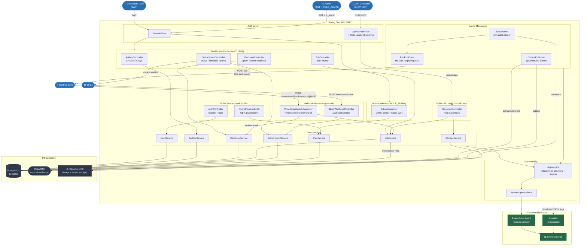

# Omni3D — High-Level Architecture

```mermaid
flowchart TD
    %% ── Actors ──────────────────────────────────────────────
    Dev(["🧑‍💻 API Consumer\n(X-API-KEY)"])
    User(["👤 Dashboard User\n(JWT)"])
    Admin(["🔑 Admin\n(JWT + ROLE_ADMIN)"])
    Stripe(["💳 Stripe"])
    RunPod(["⚡ RunPod GPU"])

    %% ── Spring Boot ─────────────────────────────────────────
    subgraph App["Spring Boot API  :8080"]
        direction TB

        subgraph Auth["Auth Layer"]
            ApiKeyFilter["ApiKeyAuthFilter\n+ Rate Limiter (Bucket4j)"]
            JwtFilter["JwtAuthFilter"]
        end

        subgraph PublicRoutes["Public Routes  /auth  /public"]
            AuthCtrl["AuthController\nregister / login"]
            PlanCtrl["PublicPlanController\nGET /public/plans"]
        end

        subgraph DashRoutes["Dashboard  /dashboard/**  (JWT)"]
            AKCtrl["ApiKeyController\nCRUD API keys"]
            WHCtrl["WebhookController\nupsert / delete webhook"]
            JobCtrl["JobController\nlist / history"]
            SubCtrl["SubscriptionController\nstatus / checkout / portal"]
        end

        subgraph AdminRoutes["Admin  /admin/**  (ROLE_ADMIN)"]
            AdminCtrl["AdminController\nCRUD plans + Stripe sync"]
        end

        subgraph ApiRoutes["Public API  /api/v1/**  (API Key)"]
            GenCtrl["GenerateController\nPOST /generate"]
        end

        subgraph WebhookRoutes["Webhook Receivers  (no auth)"]
            RunPodCtrl["ProviderWebhookController\n/internal/webhooks/runpod"]
            StripeCtrl["StripeWebhookController\n/webhooks/stripe"]
        end

        subgraph Core["Core Services"]
            JS["JobService"]
            AKS["ApiKeyService"]
            SubS["SubscriptionService"]
            PS["PlanService"]
            WHS["WebhookService"]
            US["UserService"]
            SS["StorageService"]
        end

        subgraph Messaging["Async Messaging"]
            Outbox["OutboxPublisher\n@Scheduled 500ms"]
            Worker["TaskWorker\n@RabbitListener"]
            RPClient["RunPodClient\nfire-and-forget dispatch"]
        end

        subgraph Observability["Observability"]
            Metrics["AppMetrics\n(Micrometer counters + timers)"]
            Prom["/actuator/prometheus"]
        end
    end

    %% ── Infrastructure ───────────────────────────────────────
    subgraph Infra["Infrastructure"]
        PG[("PostgreSQL\n12 tables")]
        RMQ(["RabbitMQ\nomni3d.exchange"])
        R2["☁️ Cloudflare R2\n(image + model storage)"]
    end

    subgraph ObsStack["Observability Stack"]
        Promtail["Promtail\n(log shipper)"]
        PromAgent["Prometheus Agent\n(metrics scraper)"]
        Grafana["📊 Grafana Cloud"]
    end

    %% ── Request flows ────────────────────────────────────────
    Dev -->|"X-API-KEY"| ApiKeyFilter
    User -->|"JWT"| JwtFilter
    Admin -->|"JWT + is_admin"| JwtFilter

    ApiKeyFilter -->|"rate-limited"| GenCtrl
    JwtFilter --> DashRoutes
    JwtFilter --> AdminRoutes

    AuthCtrl --> US --> PG
    AKCtrl --> AKS --> PG
    WHCtrl --> WHS --> PG
    JobCtrl --> JS --> PG
    SubCtrl --> SubS --> PG
    AdminCtrl --> PS --> PG
    PlanCtrl --> PS
    GenCtrl --> SS --> R2
    GenCtrl --> JS

    %% Outbox pipeline
    JS -->|"write outbox msg"| PG
    Outbox -->|"poll unpublished"| PG
    Outbox -->|"publish"| RMQ
    Worker -->|"consume"| RMQ
    Worker --> RPClient
    RPClient -->|"POST job\n(fire-and-forget)"| RunPod

    %% RunPod callback
    RunPod -->|"POST /internal/webhooks/runpod/{jobId}"| RunPodCtrl
    RunPodCtrl --> JS
    RunPodCtrl -->|"deliver result"| WHS

    %% Stripe
    SubCtrl -->|"create session"| Stripe
    Stripe -->|"POST /webhooks/stripe"| StripeCtrl
    StripeCtrl --> SubS

    %% Observability wiring
    Core --> Metrics
    Messaging --> Metrics
    Metrics --> Prom
    Prom --> PromAgent --> Grafana
    App -->|"structured JSON logs"| Promtail --> Grafana

    %% Styles
    classDef infra fill:#2d3748,stroke:#718096,color:#e2e8f0
    classDef actor fill:#2b6cb0,stroke:#4299e1,color:#fff
    classDef obs fill:#276749,stroke:#48bb78,color:#fff
    class PG,RMQ,R2 infra
    class Dev,User,Admin,Stripe,RunPod actor
    class Promtail,PromAgent,Grafana obs
```
