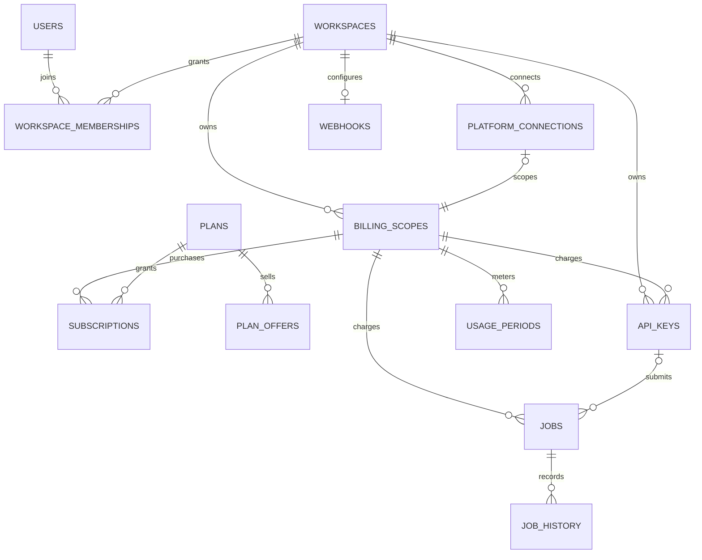

# Database baseline

Current generation implementation: [Meshy and interchangeable providers](generation/PROVIDERS.md). V3 adds durable provider task tracking; the public two-image flow uses Meshy Multi-Image-to-3D, polling and owned GLB/USDZ retention. Historical RunPod descriptions below apply to the optional worker adapter.


The development database starts from [`V1__initial_schema.sql`](../src/main/resources/db/migration/V1__initial_schema.sql). The old V1–V12 history has been removed because the project is not deployed. This is a fresh schema, not an upgrade migration.

The design is defined in [ADR 0001](adr/0001-workspaces-and-store-scoped-billing.md). Workspace ownership and billing scope are deliberately separate. One workspace can contain two Shopify stores with independent subscriptions and allowances, plus a direct API billing scope.



## Tables and constraints

| Table | Purpose |
|---|---|
| `users` | People; password credentials are optional for future external authentication |
| `workspaces` | Resource-owning tenants |
| `workspace_memberships` | User roles; at most one default workspace per user for existing direct endpoints |
| `platform_connections` | Unique verified Shopify/WooCommerce store identity, workspace and installation state |
| `billing_scopes` | One direct scope per workspace; at most one scope per connected store |
| `plans` | Product benefits and direct storefront reference pricing |
| `plan_offers` | Provider-specific monthly/yearly offer identifiers |
| `subscriptions` | Provider-neutral subscription references/state; one current subscription per scope |
| `api_keys` | Workspace-owned credentials associated with one billing scope; optional creator attribution |
| `jobs` | Workspace-owned generation charged to one scope; optional API-key origin |
| `usage_periods` | Scope/period allowance snapshots and reservation/consumption counters |
| `webhooks` | Workspace completion-notification destination |
| `job_history` | Job lifecycle audit entries |
| `outbox_messages` | Infrastructure-owned transactional delivery storage |
| `rate_limits` | Infrastructure-owned Bucket4j state |

Composite foreign keys enforce that a connection, key or job uses a scope from its own workspace, and a job's key belongs to the same scope. Removing a membership clears API-key creator attribution without changing key ownership. Provider subscription IDs are unique within their provider. Canceled/expired subscriptions can remain historical rows beside the current subscription.

Seeded free/pro/enterprise plans are development product defaults. No Shopify plan handles or Stripe prices are fabricated. Configure real `plan_offers` after setting up provider pricing. Shopify remains authoritative for its charged price and billing state.

## Local setup

```sh
make docker
make jooq
make run
```

The application, Flyway and jOOQ default to database `thridify` and the Compose development credentials `3dify`/`3dify`. Override with `DB_URL`, `DB_USER`, and `DB_PASSWORD`. jOOQ sources are generated under `build/generated-src/jooq/main`.

If an existing Compose volume predates this baseline, `POSTGRES_DB` does not create a new database when the volume already contains PostgreSQL data. Create the new development database once:

```sh
docker compose exec -T postgres createdb -U 3dify thridify
make jooq
```

The old `3dify` database can remain untouched. Do not point the new migration at a database with the retired Flyway history, and do not use `flywayRepair` to hide the mismatch. For a subsequent rewrite of this development baseline, create another empty database and set `DB_URL` to it, or deliberately recreate the disposable database after saving any fixtures you need.

Integration tests use a fresh PostgreSQL Testcontainers database and apply the same V1 migration. They do not depend on local development data.

## Implemented versus planned

Implemented: fresh schema and constraints; atomic direct-user/workspace/owner/direct-scope provisioning; existing direct endpoints persisted through their default workspace; direct Stripe offer/reference mapping; workspace webhook persistence; generation ownership/scope derived from its API key; isolated infrastructure outbox.

The V2 Shopify migration adds webhook receipts, connection reconciliation timestamps and scoped generation idempotency keys. Shopify backend installation/session verification, subscription reconciliation, generation charging and privacy cleanup are implemented. Online Admin API tokens are exchanged and discarded; background billing uses configured Partner credentials.

Planned: the separate Shopify frontend and product attachment, explicit workspace selection, shared staff authorization, scoped API-key authorization beyond existing direct endpoints, and WooCommerce integration. Live Shopify validation requires credentials and a development store.

`billing_commands` records Stripe command identities, request fingerprints, provider results and completed local results. Retain unresolved rows for reconciliation; a price recorded without a completed plan is recoverable using the original request. `stripe_event_receipts` deduplicates Stripe events per billing scope. `pending_input_uploads` retains cleanup work after failed uploads. Outbox `next_attempt_at` schedules retries for both generation messages and customer notifications.
