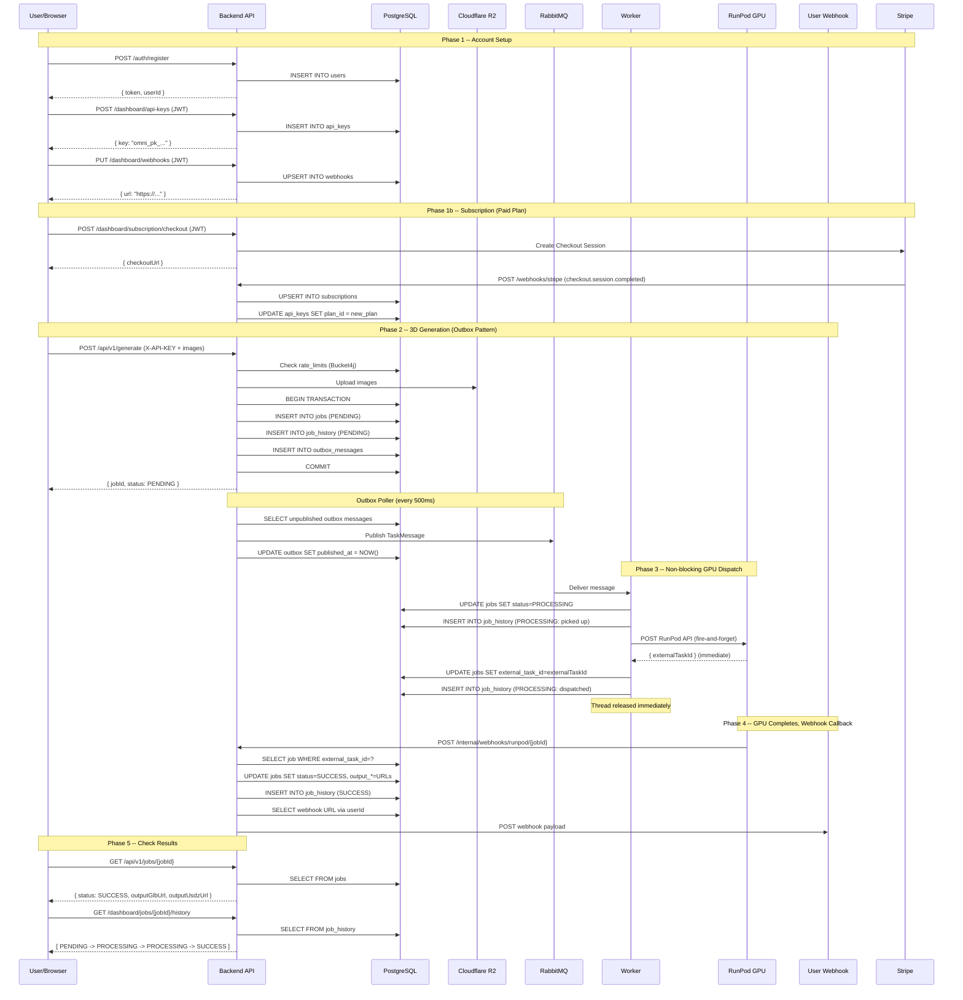

# Omni3D — System Flow & User Journey

A detailed walkthrough of every flow in the system: what gets called, what gets stored, what gets returned.

---

## Database Schema

Twelve tables, created via Flyway migrations (V1 → V12).

### `users` (V1 + V9)

| Column | Type | Notes |
|---|---|---|
| `id` | `UUID` PK | Auto-generated via `gen_random_uuid()` |
| `email` | `VARCHAR(255)` | Unique, used for login |
| `password_hash` | `VARCHAR(255)` | BCrypt hash |
| `name` | `VARCHAR(255)` | Optional display name |
| `is_admin` | `BOOLEAN` | Added in V9, defaults to `FALSE` |
| `created_at` | `TIMESTAMPTZ` | Defaults to `now()` |
| `updated_at` | `TIMESTAMPTZ` | Defaults to `now()` |

### `plans` (V2 + V8)

| Column | Type | Notes |
|---|---|---|
| `id` | `UUID` PK | Auto-generated |
| `name` | `VARCHAR(50)` | Unique: `free`, `pro`, `enterprise` |
| `display_name` | `VARCHAR(100)` | Added in V8 |
| `description` | `TEXT` | Added in V8 |
| `price_cents` | `INT` | Added in V8, defaults to `0` |
| `currency` | `VARCHAR(3)` | Added in V8, defaults to `usd` |
| `stripe_price_id` | `VARCHAR(255)`| Added in V8 |
| `is_active` | `BOOLEAN` | Added in V8, defaults to `TRUE` |
| `sort_order` | `INT` | Added in V8 |
| `rate_limit_rpm` | `INT` | Max requests/minute (10, 50, 200) |
| `monthly_quota` | `INT` | Max jobs/month (100, 2000, 50000) |
| `created_at` | `TIMESTAMPTZ` | Defaults to `now()` |

Pre-seeded:
```
free        → 10 rpm,  100 jobs/mo
pro         → 50 rpm,  2,000 jobs/mo
enterprise  → 200 rpm, 50,000 jobs/mo
```

### `api_keys` (V3)

| Column | Type | Notes |
|---|---|---|
| `id` | `UUID` PK | Auto-generated |
| `user_id` | `UUID` FK → `users.id` | `ON DELETE CASCADE` |
| `plan_id` | `UUID` FK → `plans.id` | Determines rate limit |
| `key_hash` | `VARCHAR(64)` | SHA-256 hash of the raw key |
| `key_prefix` | `VARCHAR(16)` | First 16 chars for display |
| `label` | `VARCHAR(100)` | Optional user-given name |
| `is_active` | `BOOLEAN` | Defaults `TRUE` |
| `created_at` | `TIMESTAMPTZ` | Defaults to `now()` |
| `revoked_at` | `TIMESTAMPTZ` | Set when revoked |

### `jobs` (V4 + V12)

| Column | Type | Notes |
|---|---|---|
| `id` | `UUID` PK | Auto-generated |
| `api_key_id` | `UUID` FK → `api_keys.id` | Which key submitted the job |
| `status` | `job_status` ENUM | `PENDING` → `PROCESSING` → `SUCCESS` or `FAILED` |
| `external_task_id` | `TEXT` | RunPod job ID — added in V12, used for webhook correlation |
| `input_image_1` | `TEXT` | R2 storage key |
| `input_image_2` | `TEXT` | R2 storage key |
| `output_glb_url` | `TEXT` | URL to generated `.glb` file |
| `output_usdz_url` | `TEXT` | URL to generated `.usdz` file |
| `webhook_url` | `TEXT` | Legacy column (no longer populated) |
| `error_message` | `TEXT` | Populated on failure |
| `created_at` | `TIMESTAMPTZ` | Defaults to `now()` |
| `completed_at` | `TIMESTAMPTZ` | Set on success or failure |

### `webhooks` (V5)

| Column | Type | Notes |
|---|---|---|
| `id` | `UUID` PK | Auto-generated |
| `user_id` | `UUID` FK → `users.id` | **UNIQUE** — one webhook per user |
| `url` | `TEXT` | The delivery URL |
| `created_at` | `TIMESTAMPTZ` | Defaults to `now()` |
| `updated_at` | `TIMESTAMPTZ` | Defaults to `now()` |

### `outbox_messages` (V6)

| Column | Type | Notes |
|---|---|---|
| `id` | `UUID` PK | Auto-generated |
| `aggregate_type` | `VARCHAR(50)` | e.g. `"JOB"` |
| `aggregate_id` | `UUID` | The job ID |
| `payload` | `JSONB` | Serialized `TaskMessage` |
| `created_at` | `TIMESTAMPTZ` | Defaults to `now()` |
| `published_at` | `TIMESTAMPTZ` | Set when published to RabbitMQ |

Partial index: `idx_outbox_unpublished` on `created_at WHERE published_at IS NULL`.

### `job_history` (V7)

| Column | Type | Notes |
|---|---|---|
| `id` | `UUID` PK | Auto-generated |
| `job_id` | `UUID` FK → `jobs.id` | `ON DELETE CASCADE` |
| `status` | `VARCHAR(20)` | Status at time of change |
| `details` | `TEXT` | Human-readable description |
| `created_at` | `TIMESTAMPTZ` | Defaults to `now()` |

### `subscriptions` (V10)

| Column | Type | Notes |
|---|---|---|
| `id` | `UUID` PK | Auto-generated |
| `user_id` | `UUID` FK → `users.id` | `ON DELETE CASCADE` |
| `plan_id` | `UUID` FK → `plans.id` | The subscribed plan |
| `stripe_subscription_id` | `VARCHAR(255)` | Unique Stripe Sub ID |
| `stripe_customer_id` | `VARCHAR(255)` | Stripe Customer ID |
| `status` | `VARCHAR(30)` | e.g. `active`, `past_due`, `canceled` |
| `current_period_end` | `TIMESTAMPTZ` | Renewal/expiration date |
| `created_at` | `TIMESTAMPTZ` | Defaults to `now()` |
| `updated_at` | `TIMESTAMPTZ` | Defaults to `now()` |

### `rate_limits` (V11)

Managed by **Bucket4j** — stores token bucket state for per-API-key rate limiting backed by PostgreSQL instead of Redis.

| Column | Type | Notes |
|---|---|---|
| `id` | `BIGINT` PK | Auto-increment |
| `key` | `VARCHAR(255)` | Rate limit key (e.g. `api_key:<uuid>`) |
| `tokens` | `BIGINT` | Current token count |
| `expires_at` | `TIMESTAMPTZ` | When the bucket expires |

---

## Architecture Overview

```mermaid
graph TB
    subgraph "Public Internet"
        Client["API Consumer"]
        Browser["Dashboard / Admin User"]
        RunPod["RunPod GPU Provider"]
        Stripe["Stripe"]
    end

    subgraph "Spring Boot Application"
        subgraph "Security Layer (4 Chains)"
            SC1["Chain #1 (Order 1) — API Key /api/v1/**"]
            SC2["Chain #2 (Order 2) — JWT + ROLE_ADMIN /admin/**"]
            SC3["Chain #3 (Order 3) — JWT /dashboard/**"]
            SC4["Chain #4 (Order 4) — Public (auth, plans, stripe, runpod webhooks)"]
        end

        subgraph "Controllers"
            AC["AuthController /auth"]
            AKC["ApiKeyController /dashboard/api-keys"]
            WHC["WebhookController /dashboard/webhooks"]
            JC["JobController /dashboard/jobs"]
            GC["GenerateController /api/v1"]
            PWC["ProviderWebhookController /internal/webhooks/runpod"]
            SWC["StripeWebhookController /webhooks/stripe"]
            SubC["SubscriptionController /dashboard/subscription"]
            AdminC["AdminController /admin/plans"]
            PPC["PublicPlanController /public/plans"]
        end

        subgraph "Services"
            US["UserService"]
            AKS["ApiKeyService"]
            WHS["WebhookService"]
            JS["JobService"]
            JHS["JobHistoryService"]
            OS["OutboxService"]
            SS["StorageService"]
            RLS["RateLimiterService"]
            RPC["RunPodClient"]
            PS["PlanService"]
            SubS["SubscriptionService"]
        end

        subgraph "Observability"
            AM["AppMetrics (Micrometer)"]
            Prom["/actuator/prometheus"]
        end

        subgraph "Repositories"
            UR["UserRepository"]
            PR["PlanRepository"]
            AKR["ApiKeyRepository"]
            JR["JobRepository"]
            WHR["WebhookRepository"]
            OR["OutboxRepository"]
            JHR["JobHistoryRepository"]
            SR["SubscriptionRepository"]
        end

        subgraph "Messaging"
            OP["OutboxPublisher @Scheduled 500ms"]
            TP["TaskProducer"]
            TW["TaskWorker"]
        end
    end

    subgraph "Infrastructure"
        PG["PostgreSQL"]
        RMQ["RabbitMQ"]
        R2["Cloudflare R2"]
    end

    subgraph "Observability Stack"
        Promtail["Promtail (log shipper)"]
        PromAgent["Prometheus Agent"]
        Grafana["Grafana Cloud"]
    end

    Client -->|"X-API-KEY"| SC1
    Browser -->|"Bearer JWT (admin)"| SC2
    Browser -->|"Bearer JWT"| SC3
    Browser -->|"No auth"| SC4
    RunPod -->|"Webhook callback"| SC4
    Stripe -->|"Stripe-Signature"| SC4

    SC1 --> GC
    SC2 --> AdminC
    SC3 --> AKC
    SC3 --> WHC
    SC3 --> JC
    SC3 --> SubC
    SC4 --> AC
    SC4 --> PWC
    SC4 --> SWC
    SC4 --> PPC

    AC --> US --> UR
    AKC --> AKS --> AKR
    AKS --> PR
    WHC --> WHS --> WHR
    JC --> JS --> JR
    JC --> JHS --> JHR
    GC --> JS
    GC --> SS --> R2
    JS --> OS --> OR
    JS --> JHS
    JS --> AM
    OP --> OR
    OP --> TP --> RMQ
    TW --> RMQ
    TW --> JS
    TW --> RPC -->|"POST job (fire-and-forget)"| RunPod
    PWC --> JS
    PWC --> WHS
    PWC --> AM
    SWC --> SubS --> SR
    SubS --> AKR
    AdminC --> PS --> PR
    PPC --> PS
    SubC --> SubS

    UR & JR & AKR & PR & SR & WHR & OR & JHR --> PG

    SC1 -.-|"rate limit check"| RLS --> PG
    AM --> Prom --> PromAgent --> Grafana
    Promtail -->|"log shipping"| Grafana
```



### Four Security Zones

| Zone | URL Pattern | Auth Method | Chain Order | Principal |
|---|---|---|---|---|
| **Public API** | `/api/v1/**` | `X-API-KEY` header | 1 | `apiKeyId` (UUID) |
| **Admin** | `/admin/**` | `Authorization: Bearer <JWT>` + `ROLE_ADMIN` | 2 | `userId` (UUID) |
| **Dashboard** | `/dashboard/**` | `Authorization: Bearer <JWT>` | 3 | `userId` (UUID) |
| **Public / Open** | Everything else | None | 4 | — |

Public routes allowed in chain #4: `POST /auth/register`, `POST /auth/login`, `GET /public/**`, `POST /webhooks/stripe`, `POST /internal/webhooks/runpod/**`, `/actuator/health`, `/error`.

> [!NOTE]
> The admin JWT carries a `ROLE_ADMIN` claim set when `is_admin = TRUE` in the `users` table. The `JwtAuthFilter` is shared across chains #2, #3, and #4.

---

## Repository & Entity Layer Architecture

All repositories follow a **clean entity pattern**:

- Each DB table maps to an immutable `data class` entity in `com.omni3d.api.domain`
- All repository methods accept and return typed entities — never raw JOOQ `Record`
- JOOQ field references (`DSL.field(...)`) are **fully private** inside each repository class
- Services contain zero JOOQ imports — they work with plain Kotlin data classes

| Entity | Table | Used In |
|---|---|---|
| `UserEntity` | `users` | `UserService`, `JwtAuthFilter` |
| `PlanEntity` | `plans` | `PlanService`, `ApiKeyService` |
| `ApiKeyWithPlanEntity` | `api_keys JOIN plans` | `ApiKeyService.listKeys()` |
| `ApiKeyAuthEntity` | `api_keys JOIN plans` | `ApiKeyService.validateRawKey()` |
| `JobEntity` | `jobs` | `JobService`, `ProviderWebhookController` |
| `JobHistoryEntity` | `job_history` | `JobHistoryService` |
| `SubscriptionEntity` | `subscriptions` | `SubscriptionService` |
| `SubscriptionWithPlanEntity` | `subscriptions JOIN plans` | `SubscriptionService.getStatus()` |
| `OutboxMessageEntity` | `outbox_messages` | `OutboxPublisher` |
| `WebhookEntity` | `webhooks` | `WebhookService` |

---

## Observability

### AppMetrics (`com.omni3d.api.metrics.AppMetrics`)

A central Micrometer registry component. Naming convention: `omni3d.<domain>.<action>`. Tags are used for result labels — never high-cardinality values like UUIDs.

| Metric | Type | Tags | Description |
|---|---|---|---|
| `omni3d.users.registered` | Counter | — | Successful registrations |
| `omni3d.users.logins` | Counter | `result=success\|failed` | Login outcomes |
| `omni3d.api_keys.created` | Counter | — | API keys created |
| `omni3d.api_keys.revoked` | Counter | — | API keys revoked |
| `omni3d.api_keys.validations` | Counter | `result=valid\|invalid` | Key validation outcomes |
| `omni3d.rate_limit.rejected` | Counter | — | Rate-limited requests |
| `omni3d.jobs.created` | Counter | — | Jobs submitted |
| `omni3d.jobs.dispatched` | Counter | — | Jobs sent to GPU |
| `omni3d.jobs.completed` | Counter | `result=success\|failed` | Job outcomes |
| `omni3d.jobs.duration` | Timer | — | End-to-end job duration (histogram) |
| `omni3d.outbox.published` | Counter | — | Outbox messages published |
| `omni3d.outbox.failed` | Counter | — | Outbox publish failures |
| `omni3d.runpod.dispatched` | Counter | — | Jobs sent to RunPod |
| `omni3d.runpod.callbacks` | Counter | `result=success\|failed` | RunPod webhook callbacks |
| `omni3d.runpod.errors` | Counter | — | RunPod dispatch errors |
| `omni3d.subscriptions.activated` | Counter | — | Subscriptions activated |
| `omni3d.subscriptions.canceled` | Counter | — | Subscriptions canceled |
| `omni3d.subscriptions.past_due` | Counter | — | Past-due subscriptions |
| `omni3d.webhooks.deliveries` | Counter | `result=success\|failed` | User webhook delivery outcomes |
| `omni3d.auth.failures` | Counter | `reason=invalid_key\|no_subscription\|rate_limit` | Auth failure breakdown |
| `omni3d.storage.uploads` | Counter | `result=success\|error` | R2 upload outcomes |

Metrics are exposed at `/actuator/prometheus` and scraped by the Prometheus Agent in `observability/prometheus-agent.yml`. Logs are shipped by Promtail (`observability`) — both send to **Grafana Cloud**. MDC fields `jobId`, `userId`, `apiKeyId` are injected into log lines for trace correlation.

---

## Flow 1: User Registration

**Endpoint:** `POST /auth/register` — **Auth:** None (Chain #4)

### Request
```json
{ "email": "user@example.com", "password": "s3cret123", "name": "Alice" }
```

### Steps
1. `AuthController.register()` → `UserService.register()`
2. `UserRepository.existsByEmail()` → `SELECT EXISTS(... WHERE email = ?)`
   - If exists → 409 Conflict
3. `BCryptPasswordEncoder.encode()` → hash password
4. `UserRepository.insert()` → `INSERT INTO users (...) VALUES (...)`
5. `JwtService.generateToken()` → JWT (24h expiry, HMAC-SHA)
6. `AppMetrics.usersRegistered.increment()`

### Response (201)
```json
{ "token": "eyJ...", "userId": "uuid", "email": "user@example.com" }
```

| Table | Effect |
|---|---|
| `users` | 1 row inserted |

---

## Flow 2: User Login

**Endpoint:** `POST /auth/login` — **Auth:** None (Chain #4)

### Steps
1. `UserRepository.findByEmail()` → `SELECT id, email, password_hash FROM users WHERE email = ?`
   - Not found → 401
2. `BCryptPasswordEncoder.matches()` → validate password
   - Mismatch → 401; `AppMetrics.usersLoginFailed.increment()`
3. `JwtService.generateToken()` → JWT
4. `AppMetrics.usersLoginSuccess.increment()`

### Response (200)
```json
{ "token": "eyJ...", "userId": "uuid", "email": "user@example.com" }
```

---

## Flow 3: Create API Key

**Endpoint:** `POST /dashboard/api-keys` — **Auth:** JWT (Chain #3)

### Steps
1. `PlanRepository.findByName()` → `SELECT id, name FROM plans WHERE name = ?`
2. Generate raw key: `"omni_pk_" + 40 random chars`
3. SHA-256 hash + prefix extraction
4. `ApiKeyRepository.insert()` → `INSERT INTO api_keys (...) VALUES (...)`
5. `AppMetrics.apiKeysCreated.increment()`

### Response (201)
```json
{ "id": "uuid", "key": "omni_pk_...", "label": "...", "planName": "pro", "createdAt": "..." }
```

> [!CAUTION]
> Raw key returned **once only** — only the hash is stored.

---

## Flow 4: Configure Webhook

**Endpoint:** `PUT /dashboard/webhooks` — **Auth:** JWT (Chain #3)

### Request
```json
{ "url": "https://myapp.com/webhook" }
```

### Steps
1. `WebhookController.setWebhook()` extracts `userId` from JWT principal
2. `WebhookService.setWebhook()` → `WebhookRepository.upsert()`
   - If row exists for user: `UPDATE webhooks SET url = ?, updated_at = NOW() WHERE user_id = ?`
   - If no row: `INSERT INTO webhooks (id, user_id, url) VALUES (?, ?, ?)`

### Response (200)
```json
{ "id": "uuid", "url": "https://myapp.com/webhook", "createdAt": "...", "updatedAt": "..." }
```

### Other webhook endpoints:
- `GET /dashboard/webhooks` → returns current webhook or null
- `DELETE /dashboard/webhooks` → removes the webhook (204)

| Table | Effect |
|---|---|
| `webhooks` | 1 row upserted |

---

## Flow 5: Generate 3D Model (Outbox Pattern)

**Endpoint:** `POST /api/v1/generate` — **Auth:** `X-API-KEY` (Chain #1)

### Request (multipart/form-data)
```
image1: <binary>
image2: <binary>
```

### API Key Auth (every `/api/v1/**` request)
1. `ApiKeyAuthFilter` reads `X-API-KEY` header
2. SHA-256 → lookup `api_keys JOIN plans` by hash
3. Rate limit check via **Bucket4j** (token bucket stored in `rate_limits` table, PostgreSQL-backed)
   - Rejected → 429; `AppMetrics.rateLimitRejections.increment()`
4. Sets principal = `apiKeyId`

### Steps (after auth)
1. Validate images non-empty
2. Upload both to R2: `inputs/<UUID>_<filename>` — `AppMetrics.storageUploads.increment()`
3. **Single transaction:**
   - `JobRepository.insert()` → `INSERT INTO jobs (id, api_key_id, input_image_1, input_image_2) VALUES (...)`
   - `JobHistoryService.recordChange()` → `INSERT INTO job_history (job_id, status, details) VALUES (?, 'PENDING', 'Job created')`
   - `OutboxService.saveEvent()` → `INSERT INTO outbox_messages (aggregate_type, aggregate_id, payload) VALUES ('JOB', ?, '{...}')`
4. `AppMetrics.jobsCreated.increment()`

### Response (202)
```json
{ "jobId": "uuid", "status": "PENDING" }
```

| Table | Effect |
|---|---|
| `jobs` | 1 row (`PENDING`) |
| `job_history` | 1 row (`PENDING`) |
| `outbox_messages` | 1 row (unpublished) |

---

## Flow 6: Outbox Publisher (Scheduled)

Runs every **500ms** via `@Scheduled`.

### Steps
1. `OutboxRepository.findUnpublished(50)` → `SELECT ... FROM outbox_messages WHERE published_at IS NULL ORDER BY created_at LIMIT 50`
2. For each message:
   - Deserialize payload → `TaskMessage`
   - `TaskProducer.sendTask()` → publish to RabbitMQ exchange `omni3d.exchange` / routing key `generate.3d`
   - `OutboxRepository.markPublished(id)` → `UPDATE outbox_messages SET published_at = NOW() WHERE id = ?`
   - `AppMetrics.outboxPublished.increment()` (or `.outboxFailed` on error)

| Table | Effect |
|---|---|
| `outbox_messages` | `published_at` set |

---

## Flow 7: Async Worker → GPU Dispatch (Non-blocking)

Triggered by RabbitMQ message delivery.

### Steps
1. `TaskWorker.handleTask()` deserializes `TaskMessage` from queue
2. `JobService.markProcessing(jobId)` → updates `jobs.status = 'PROCESSING'` + inserts `job_history` row
3. `RunPodClient.startGeneration()` → **fire-and-forget POST** to RunPod API
   - Payload includes R2 image keys and a webhook callback URL: `POST /internal/webhooks/runpod/{jobId}`
   - Returns `externalTaskId` immediately
   - `AppMetrics.runpodDispatched.increment()`
4. `JobService.updateExternalTaskId(jobId, externalTaskId)` → saves RunPod task ID to `jobs.external_task_id`
5. Thread released — worker is **done**. GPU result arrives later via webhook.

### On dispatch failure
- `JobService.markFailed(jobId, errorMessage)` — `AppMetrics.runpodDispatchErrors.increment()`

> [!NOTE]
> In development, `RunPodClient` uses a mock: it spawns a background thread, sleeps 5 seconds, then self-calls `/internal/webhooks/runpod/{jobId}` with a `COMPLETED` payload. Production simply removes the mock block and uncomments the real HTTP call.

| Table | Effect |
|---|---|
| `jobs` | `status → PROCESSING`, `external_task_id` set |
| `job_history` | 2 rows added (PROCESSING × 2: pickup + dispatch) |

---

## Flow 8: RunPod Webhook Callback

**Endpoint:** `POST /internal/webhooks/runpod/{jobId}` — **Auth:** None / network-trust (Chain #4)

### Payload from RunPod
```json
{ "id": "runpod-task-id", "status": "COMPLETED", "output": { "glb": "...", "usdz": "..." } }
```

### Steps
1. `ProviderWebhookController.handleRunPodWebhook()` — verifies `payload.id` maps to `jobId` via `JobService.findJobByExternalTaskId()`
   - Mismatch → 400 Bad Request
2. On `COMPLETED`:
   - `JobService.markSuccess(jobId, glbUrl, usdzUrl)` → updates `jobs`, inserts `job_history`, records job duration metric
   - `AppMetrics.runpodCallbacks.increment()`
   - `fireUserWebhook()` → looks up `userId` → looks up webhook URL → `POST` payload to user's URL
   - `AppMetrics.webhookDeliveriesSuccess/Failed.increment()`
3. On `FAILED`:
   - `JobService.markFailed(jobId, "GPU Provider reported failure")`
   - `AppMetrics.runpodCallbacksFailed.increment()`
   - `fireUserWebhook()` with `"status": "FAILED"`

### User webhook payload
```json
{ "jobId": "uuid", "status": "SUCCESS", "outputGlbUrl": "...", "outputUsdzUrl": "..." }
```

| Table | Effect |
|---|---|
| `jobs` | `status`, `output_*`, `completed_at` updated |
| `job_history` | 1 row added (SUCCESS or FAILED) |

---

## Flow 9: Poll Job Status

**Endpoint:** `GET /api/v1/jobs/{jobId}` — **Auth:** `X-API-KEY` (Chain #1)

`JobRepository.findById()` → `SELECT * FROM jobs WHERE id = ?`

Also available via dashboard:
- `GET /dashboard/jobs` — lists all jobs for the authenticated user
- `GET /dashboard/jobs/{jobId}` — single job by ID

---

## Flow 10: View Job History

**Endpoints:**
- `GET /api/v1/jobs/{jobId}/history` (API key auth)
- `GET /dashboard/jobs/{jobId}/history` (JWT auth)

`JobHistoryRepository.findAllByJobId()` → `SELECT * FROM job_history WHERE job_id = ? ORDER BY created_at ASC`

### Response
```json
[
  { "id": "uuid", "jobId": "uuid", "status": "PENDING", "details": "Job created", "createdAt": "..." },
  { "id": "uuid", "jobId": "uuid", "status": "PROCESSING", "details": "Worker picked up job", "createdAt": "..." },
  { "id": "uuid", "jobId": "uuid", "status": "PROCESSING", "details": "Job dispatched to GPU with ID: runpod-xxx", "createdAt": "..." },
  { "id": "uuid", "jobId": "uuid", "status": "SUCCESS", "details": "GLB: ... | USDZ: ...", "createdAt": "..." }
]
```

---

## Flow 11: Stripe Subscriptions & Webhooks

**Endpoints:**
- `GET /dashboard/subscription` → Get current subscription status (JWT Auth, Chain #3)
- `POST /dashboard/subscription/checkout` → Creates Stripe Checkout Session
- `POST /dashboard/subscription/portal` → Creates Stripe Customer Portal Session
- `POST /webhooks/stripe` → Stripe Webhook Handler (no auth, Chain #4)
- `GET /public/plans` → Lists all active plans for pricing page (no auth, Chain #4)

### Checkout Flow
1. User requests checkout for a specific `planId` via dashboard.
2. `SubscriptionService.createCheckoutSession()` looks up plan price.
3. If free: upserts `subscriptions` immediately and links API keys to the new plan.
4. If paid: creates a Stripe `Session` configured for subscription and returns the checkout URL.

### Webhook Flow (`POST /webhooks/stripe`)
Stripe posts with `Stripe-Signature` header (verified via `StripeConfig` webhook secret):
- `checkout.session.completed`: Upserts the `subscriptions` table with `stripe_subscription_id` and active status. Syncs user's `api_keys` to the new `plan_id`. `AppMetrics.subscriptionsActivated.increment()`
- `customer.subscription.updated`: Updates status in `subscriptions`. If returned to `active`, re-enables associated API keys.
- `customer.subscription.deleted`: Marks subscription as `canceled` and deactivates associated API keys. `AppMetrics.subscriptionsCanceled.increment()`
- `invoice.payment_failed`: Marks subscription as `past_due`. `AppMetrics.subscriptionsPastDue.increment()`

---

## Flow 12: Admin — Plan Management

**Endpoints:** `/admin/plans/**` — **Auth:** JWT + `ROLE_ADMIN` (Chain #2)

Only users with `is_admin = TRUE` in `users` table can access. The JWT carries the `ROLE_ADMIN` granted authority.

| Endpoint | Description |
|---|---|
| `GET /admin/plans` | List all plans (including inactive) |
| `POST /admin/plans` | Create new plan (auto-creates Stripe Product + Price if `priceCents > 0`) |
| `PUT /admin/plans/{id}` | Update plan fields |
| `DELETE /admin/plans/{id}` | Deactivate a plan (`is_active = false`) |

When a paid plan is created via `PlanService.createPlan()`, it calls Stripe SDK to:
1. `Product.create()` — creates a Stripe product
2. `Price.create()` — creates a monthly recurring price
3. Stores the returned `stripe_price_id` in the `plans` table

---

## Complete Journey Timeline


