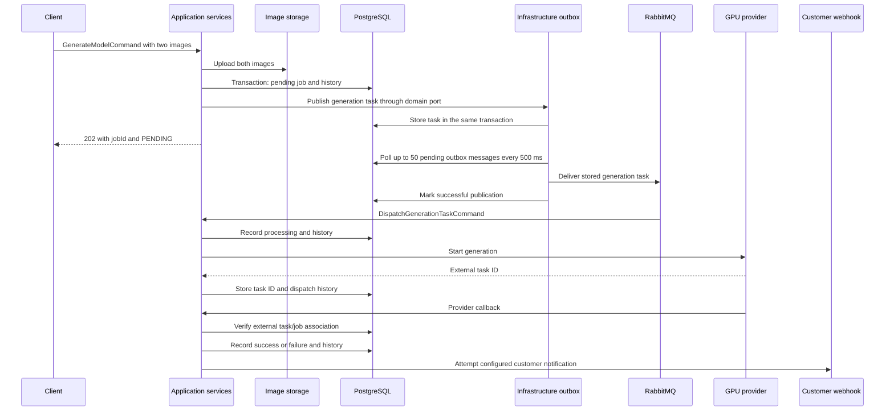

# thridify system flows

The current backend follows [DSA](architecture.md). Protocol adapters call one application service per operation. Package namespace: `com.thridify`.

## Endpoints and use cases

| Endpoint | Application service | Authentication |
|---|---|---|
| `POST /auth/register` | RegisterUser | Public |
| `POST /auth/login` | LoginUser | Public |
| `GET /public/plans` | ListActivePlans | Public |
| `GET /admin/plans` | ListPlans | JWT + administrator |
| `POST /admin/plans` | CreatePlan | JWT + administrator |
| `PUT /admin/plans/{id}` | UpdatePlan | JWT + administrator |
| `DELETE /admin/plans/{id}` | DeactivatePlan | JWT + administrator |
| `POST /dashboard/api-keys` | CreateApiKey | JWT |
| `GET /dashboard/api-keys` | ListApiKeys | JWT |
| `DELETE /dashboard/api-keys/{keyId}` | RevokeApiKey | JWT |
| `GET /dashboard/subscription` | GetSubscriptionStatus | JWT |
| `POST /dashboard/subscription/checkout` | CreateCheckoutSession | JWT |
| `POST /dashboard/subscription/portal` | CreateBillingPortal | JWT |
| `GET /dashboard/webhooks` | GetWebhook | JWT |
| `PUT /dashboard/webhooks` | SetWebhook | JWT |
| `DELETE /dashboard/webhooks` | DeleteWebhook | JWT |
| `GET /dashboard/jobs` | ListUserJobs | JWT |
| `GET /dashboard/jobs/{jobId}/history` | GetJobHistory | JWT |
| `POST /api/v1/generate` | GenerateModel | API key |
| `GET /api/v1/jobs` | ListApiKeyJobs | API key |
| `GET /api/v1/jobs/{jobId}` | GetJob | API key |
| `GET /api/v1/jobs/{jobId}/history` | GetJobHistory | API key |
| `POST /webhooks/stripe` | HandleStripeWebhook | Stripe signature |
| `POST /internal/webhooks/runpod/{jobId}` | HandleGenerationCallback | Provider task/job correlation |

All names in the table have the `ApplicationService` suffix. Creation returns the existing 201 or 202 status, deletions return 204, and the existing JSON fields remain unchanged.

## Authentication

Direct registration atomically provisions the user, workspace, owner membership and direct billing scope. Current dashboard endpoints resolve that user’s default workspace; explicit workspace selection and Shopify staff authentication are not implemented yet.

JWT authentication verifies the token via the token port and looks up administrator status through the user repository. The filter maps the application result into Spring authorities. Administrator status is read from PostgreSQL, rather than trusted from a token role claim.

API authentication reads `X-API-KEY`, checks its prefix/hash and active flag, loads the subscription, checks eligibility, then consumes a PostgreSQL-backed Bucket4j token. Invalid keys produce 401, absent/ineligible subscriptions 403, and exhausted rate limits 429. Subscription rejection does not consume rate-limit capacity. The API principal remains the API-key ID; the dashboard principal remains the user ID.

## Generation lifecycle

Empty images fail before storage access. An upload failure creates no job. If job/history/outbox persistence fails, the database work rolls back together; previously uploaded images remain, matching the existing behavior.

Dispatch errors record `FAILED` and do not notify the user. Completion callbacks reject a mismatched task ID with 400. Completed outputs default absent GLB/USDZ URLs to empty strings; a completed callback with no output object remains in progress. Failed callbacks use the existing GPU-failure text. Database-processing exceptions produce 500; customer notification failures are measured and swallowed after recording the job outcome.

The customer notification JSON remains `jobId`, `status`, `outputGlbUrl`, and `outputUsdzUrl`. Task wire JSON remains `jobId`, `inputImage1Key`, and `inputImage2Key`.

The development RunPod adapter generates a mock task ID and simulates a completion callback after a delay. Real dispatch remains commented out in that adapter.

## Billing

Free checkout upserts an active subscription, changes the plan for the direct scope's active API keys, records activation, and returns the requested success URL. Free subscriptions use provider `internal`; paid subscriptions store provider `stripe` and generic external references. Paid checkout requires a monthly Stripe plan offer and creates a subscription-mode session. It retains the success-URL suffix `?session_id={CHECKOUT_SESSION_ID}` and `userId`/`planId` metadata. Billing portal creation requires a subscription with a linked Stripe customer.

| Stripe event | Effect |
|---|---|
| `checkout.session.completed` | Retrieve subscription state, upsert it, update active API-key plans, measure activation |
| `customer.subscription.updated` | Update status/period end; reactivate API keys only for `active` |
| `customer.subscription.deleted` | Mark canceled; deactivate the direct scope's keys |
| `invoice.payment_failed` | Mark the customer's subscriptions past due; preserve current key activation flags |
| Other event | Acknowledge without state changes |

Signature verification and Stripe SDK model mapping belong to infrastructure. The application service receives typed billing events. Paid plan creation creates a Stripe product/monthly price before inserting the local plan. Updating local prices does not change Stripe prices, matching existing behavior.

## Persistence and follow-ups

The single `V1__initial_schema.sql` migration creates 15 tables, including workspaces, memberships, platform connections, billing scopes, plans/offers, provider-neutral subscriptions and scope-based usage periods. Resource ownership is persisted on workspaces; subscriptions and allowances belong to billing scopes. API-key creator identity is attribution, not resource ownership. See the [database guide](docs/database.md) for constraints and fresh-database setup.

Current direct APIs still expose user-oriented commands and some Stripe-oriented DTOs. PostgreSQL adapters resolve the default workspace and direct scope to keep those flows operational. This is a transition boundary, not completed multi-workspace authorization. Shopify installation, hosted pricing, verified subscription synchronization, staff access and usage enforcement remain upcoming work under [ADR 0001](docs/adr/0001-workspaces-and-store-scoped-billing.md). Shopify installation resolves a store connection; each store gets an independent billing scope rather than sharing a workspace subscription implicitly.

Duplicate handling, checkout compensation/transaction timing, atomic worker/callback writes, and job ownership checks remain recorded in the [migration findings](docs/dsa-migration/PLAN.md). Broker identities, API-key prefixes, configuration namespaces and metric names retain their existing values.
